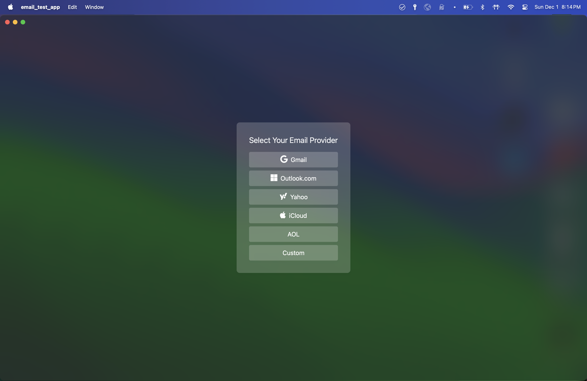

# Wails Email test app

A simple email client

## About

This project was created using [wails](https://wails.io) with the [React/TS/Vite/Tailwind template](https://github.com/hotafrika/wails-vite-react-ts-tailwind-template)

Created by Kade Angell

Current Status: PARTIALLY WORKING

## Features

- [X] Fetching inboxes
- [X] Basic user log in
- [X] Fetching emails for inbox
- [X] Fetching content for a given email
- [X] Parsing email body and returning the relevant HTML
- [X] Rendering an email's content
- [X] Transparent background
- [O] User login with support for common IMAP providers
- [ ] User login with support for 2-factor auth
- [ ] Drafting emails
- [ ] Sending emails

## Screenshots

Login page:

Email page:

